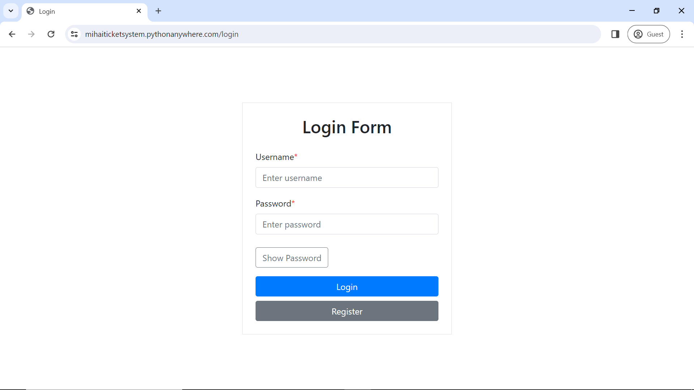
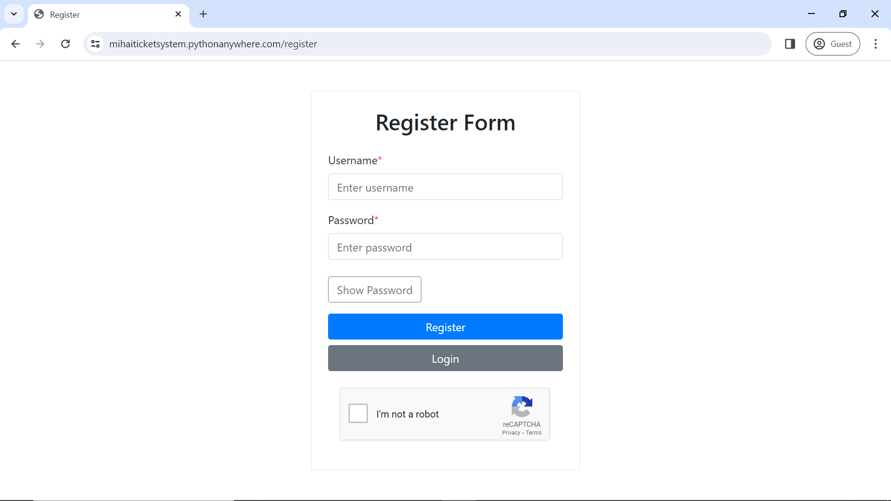
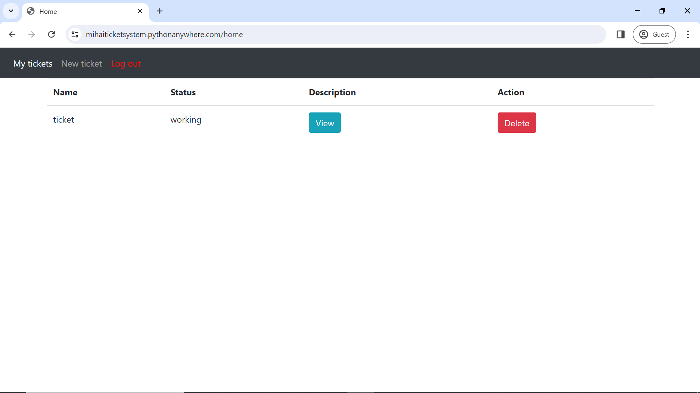
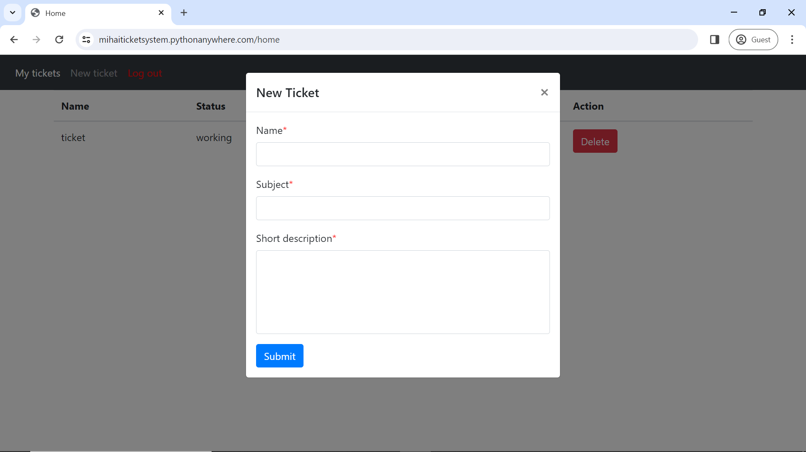
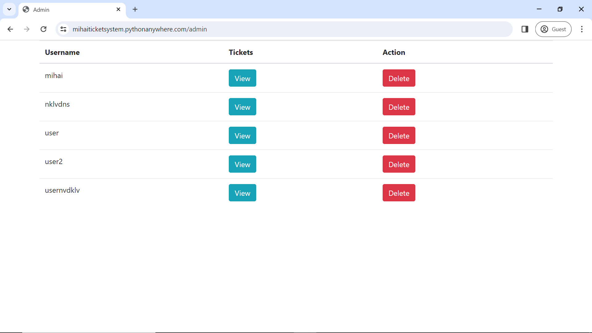
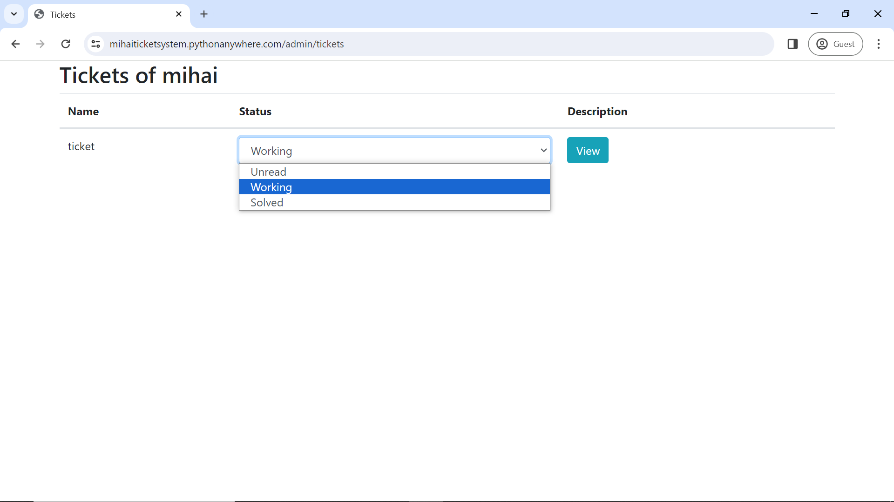

# Ticketing System Website

## Overview
This repository hosts the codebase for a ticketing website designed to manage user tasks and tickets efficiently. The website allows users to register, log in, create tickets, manage their tickets, and administrators can perform various administrative tasks like managing users and ticket statuses.

The live version of the website can be accessed at [https://mihaiticketsystem.pythonanywhere.com](https://mihaiticketsystem.pythonanywhere.com).

## Features
- **User Authentication**: Users can register and log in securely to access the ticketing system.
- **Registration with reCAPTCHA Protection**: Registration process includes reCAPTCHA protection to prevent spam registrations.
- **Ticket Creation**: Users can create tickets with a name, subject, and description.
- **Ticket Management**: Users can delete their own tickets as needed.
- **Administrator Functions**:
  - Delete Users: Administrators can delete user accounts as necessary.
  - Manage Tasks: Administrators can view and manage tasks assigned to users.
  - Task Status Update: Administrators can update task status from unread to working or solved.

## Screenshots
Here are some screenshots to provide a visual overview of the website's functionality:

1. Login Page:
   

2. Registration Page:
   

3. Home Page:
   

4. Ticket Creation:
   

5. Admin Panel:
   

5. Ticket Update:
   

## Usage
You can clone this repository using:
   ```bash
   https://github.com/mihai-ciorobitca/MihaiTicketsSystem
   ```
